# ComfortPick Workflow Diagrams

This file captures the current implemented app flow.

It is a snapshot of how the product works today, not a future-state design.

## 1. Product flow

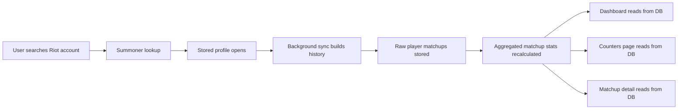

## 2. High-level architecture

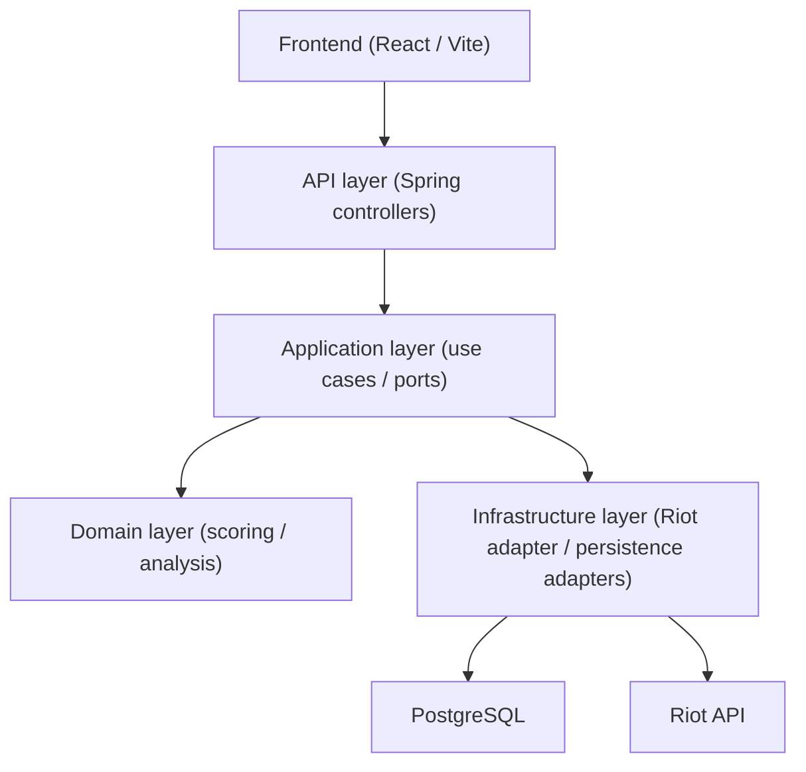

## 3. Search and profile-open flow

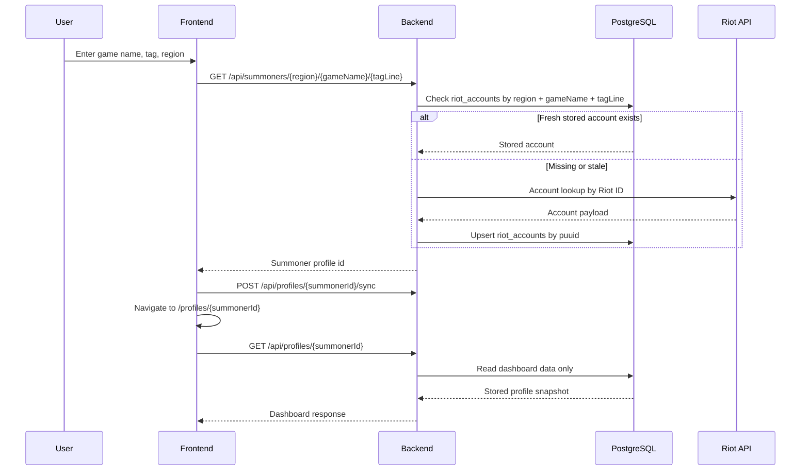

## 4. Background sync flow

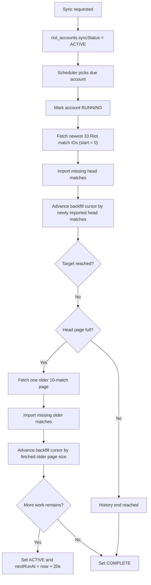

## 5. Sync failure and repair behavior

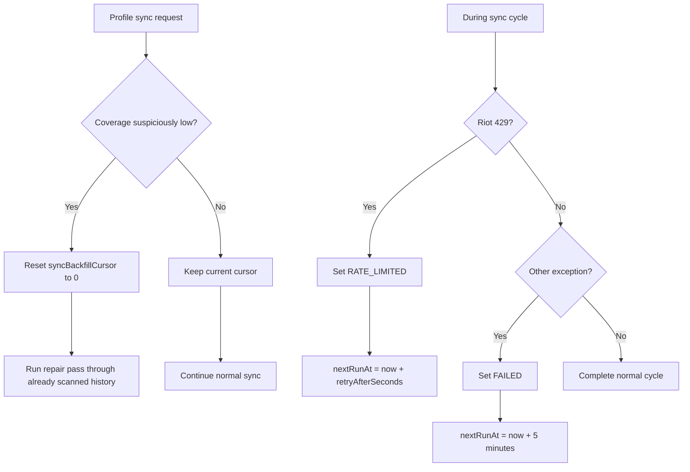

## 6. Match import and extraction flow

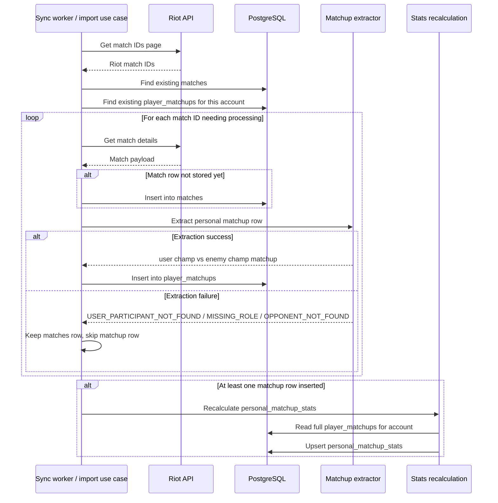

## 7. Role resolution and opponent detection

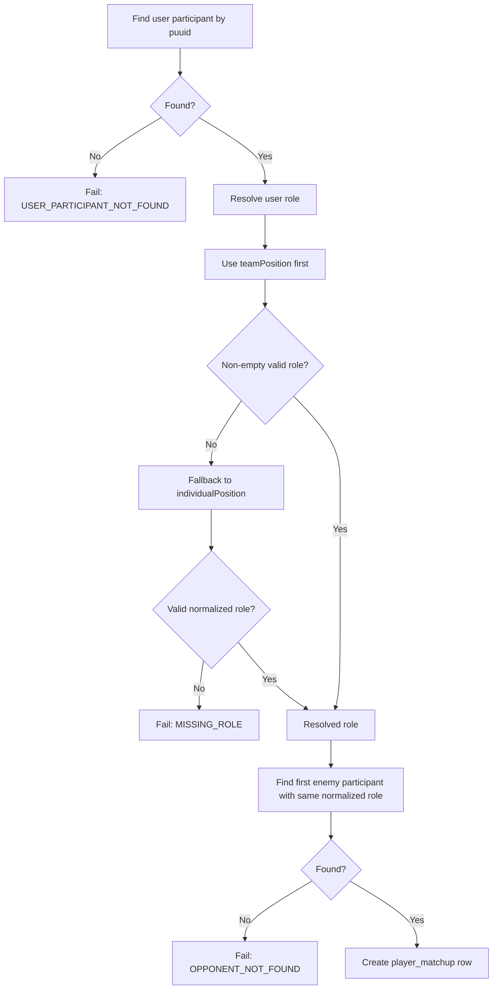

## 8. Stats recalculation flow

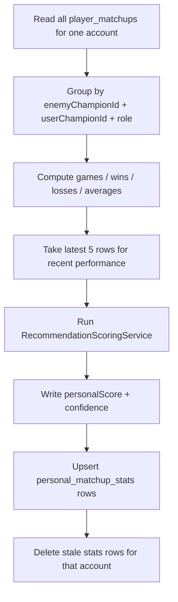

## 9. Counters page read flow

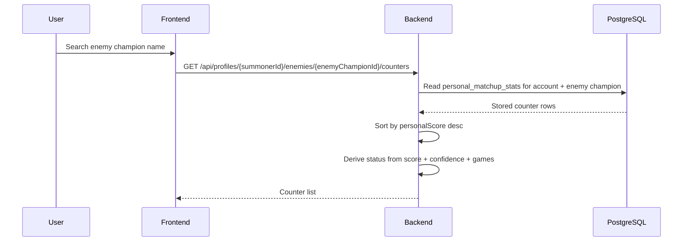

## 10. Matchup detail read flow

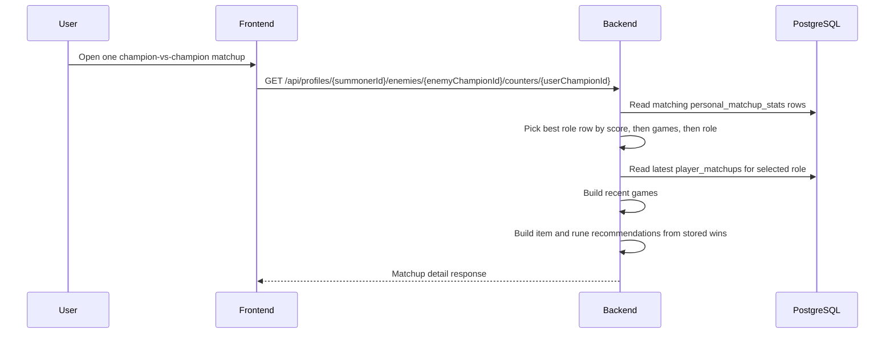

## 11. Current database model

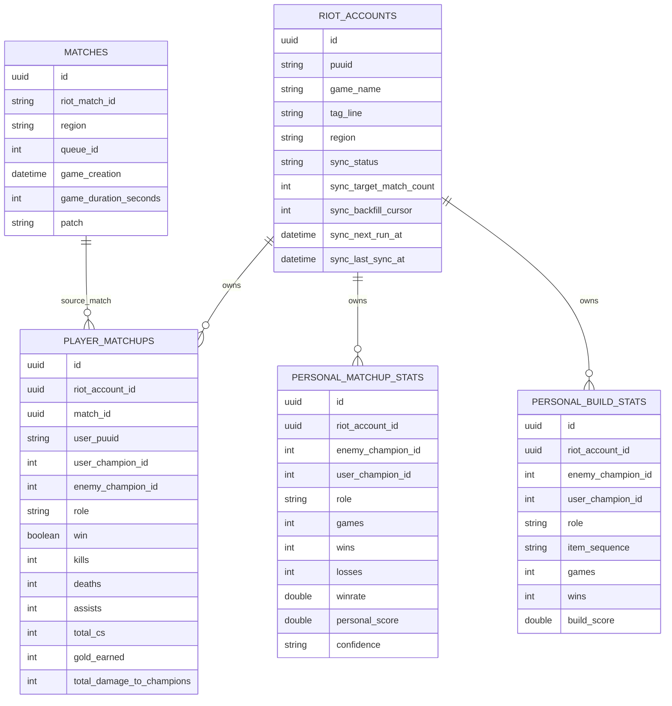

## 12. Current frontend route map

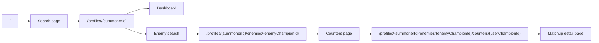

## 13. What the numbers mean

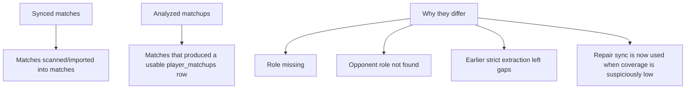

